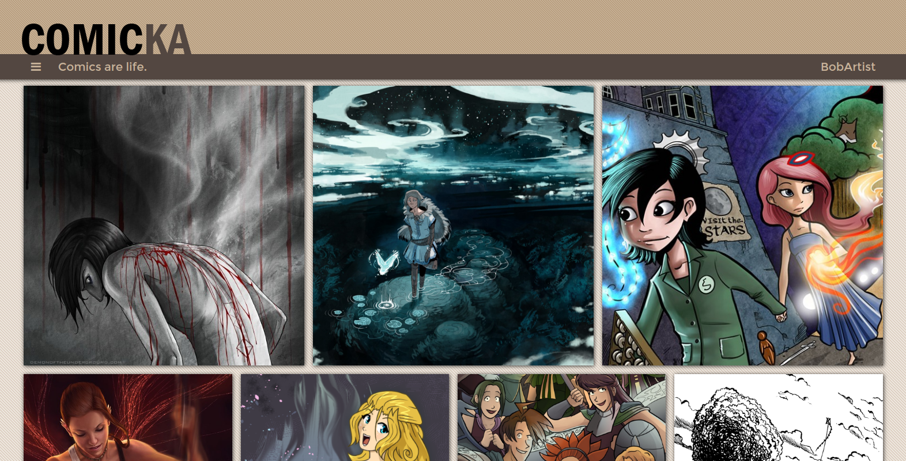

# COMICKA

Comicka is a platform for webcomic readers and creators. Users may upload their
comics to share with the world, and anyone is free to browse the site and
discover new creations.

Live site: [Comicka][http://comicka.io]

## Implementation

Comicka is a single-page app built on a Ruby-on-Rails backend and PostgreSQL
database. Its frontend is made with React.js and supported by Flux application
architecture.

#### Comics

Each comic is essentially a collection of pages. In the comic view, a navbar
tracks your place in the comic and allows for intuitive navigation. Creator
commentary is displayed along with each page. The navbar also allows displays
different links, such as uploading or editing a comic, if the reader is logged
in or is the creator of the comic.

#### Uploading and Editing

Different levels of authentication protect the uploading and editing of comics.
Frontend and backend verification makes sure that only registered users can
upload comics, and only the owner of a comic can edit it.

Sign in as the demo user, Minna, and you'll be able to mess around with the
comic _Stand Still, Stay Silent_.

Image uploading is taken care of by integration with the Cloudinary API, which
ensures a reliable interface and great load speeds.

## Looking Forward

A few more features could turn Comicka into something truly special.

#### Profiles

Users need profile pages. These will keep track of the comics they have created
and the comics they are reading; it will also track their progress, and let
users know when comics they are reading have been updated.

#### Comments

Users should be able to comment on each page. Administrators and comic creators
should be able to moderate these comments, and an upvote/downvote system should
be implemented.
