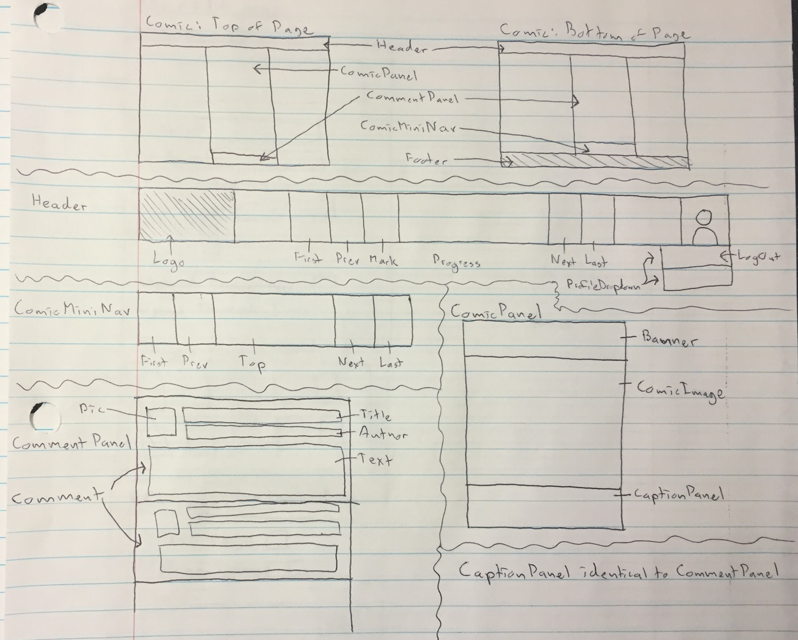
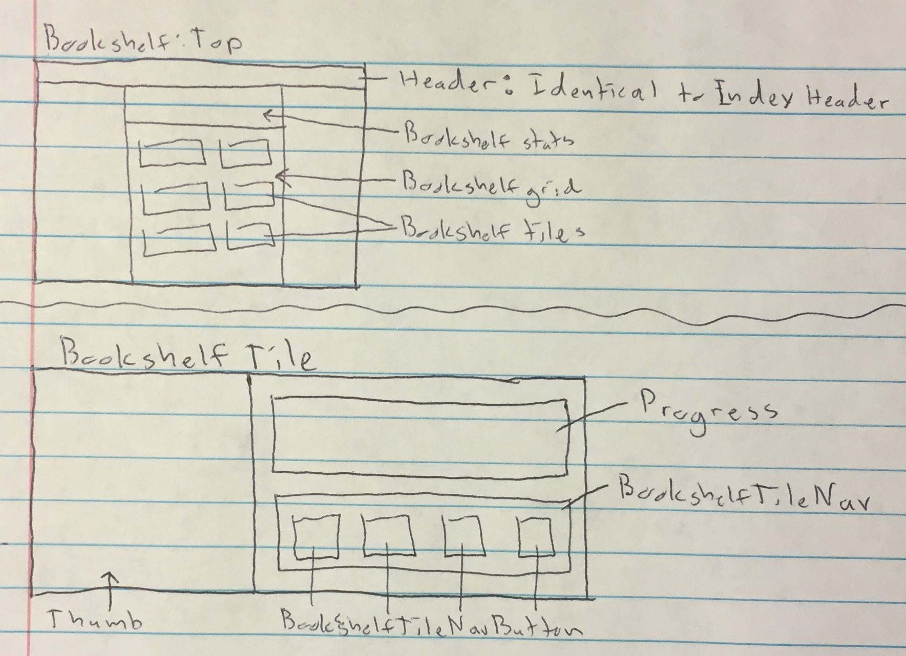
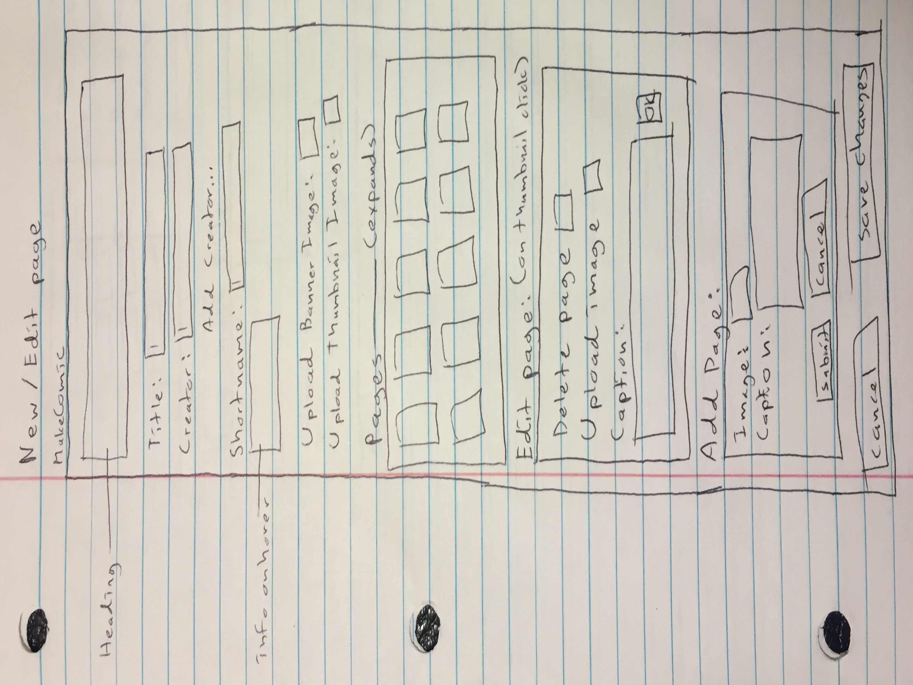

# Capstone: Comicka 
- [Comicka [Live Site [soon]]](#top)
- [Minimum Viable Product](#mvp)
- [Wireframes](#wires)
- [React Routes](#routes)
- [React Components](#components)
  - [Index](#index)
  - [Read Comic](#comic)
  - [Bookshelf](#bookshelf)
  - [New/Edit Comic](#new)
- [Flux Cycles](#flux)
  - [Comic Cycle](#comic-cycle)
  - [Page Cycle](#page-cycle)
  - [Search Suggestion Cycle](#search-cycle)
- [Database Schema](#schema)
- [API Endpoints](#api)
- [Production Timeline](#timeline)

## Minimum Viable Product [[top]](#top)
Comicka is a web application inspired by DeviantArt and Hiveworks that will allow users to upload webcomics, read and follow webcomics, and interact via comments. It will be built on a Ruby-on-Rails backend, PostgreSQL database, and React/Flux frontend.

By the end of week nine, this app will satisfy the following criteria:

    1. Hosted on Heroku
    2. Production README to replace this file

    3. Site overview:
      - Appropriate, intuitive navigation
      - Adequate seed data
      - Free of bugs and console logs
      - Gorgeous!

    4. Account creation and authorization:
      - Sign up, sign in, demo user!
      - Guests may browse full site
      - Users may upload comics, have bookshelf

    5. Comics:
      - Displays comic and caption
      - Keyboard navigation: forward, backward

    6. Index:
      - Shows all comics
      - Searchable/sortable
      - Read or follow in one click

    7. Bookshelf:
      - Shows all comics user is following
      - Sortable/searchable

    8. New / Update Comic
      - Upload page and captions

    9. Bonus Features:
      - Comments!
      - Improved search: by genre, creator, etc.
      - Bookmarking of readers' place in each comic
      - Creator styling of comic pages
      - Nested comments
      - Moderator accounts for trimming comments, etc.
      - Recommended/similar comics per user and per comic
      - Comics have chapter/section markers
      - Comment upvotes/downvotes; comment hiding
      - Featured comments
      - Organizable/draggable bookshelf items
      - Multiple view options: tiles, list style, etc.
      - Fancy, comment-style captions
      - Update schedules

## Wireframes [[top]](#top)

       I have no idea why this image is so angry. I'm very sorry.
       I've done everything in my power to coax it into cooperating,
       and it has summarily refused. I will replace these with lovely,
       well-behaved screenshots in the production readme.  

## Routes [[top]](#top)
    <Route path="/" component={App}>
      <IndexRoute component={ComicIndex} />
      <Route path=":comicID/:pageID" component={ComicPage} />
      <Route path="new" component={NewComic} />
      <Route path=":comicID/edit" component={EditComic} />
      <Route path="bookshelf" component={Bookshelf} />
    </Route>

## Components [[top]](#top)

#### Index
    App
      Header
        Logo
        HeaderButtons
        Search
        ProfilePic / LogIn
      ComicGrid
        ComicTiles
          TileImg
          TileTitle
          TileNav
        NavFooter
          First
          Prev
          PaginationNavButton
          Next
      Footer

#### Comic
    App
      Header
        Logo
        Buttons: First, Previous
        Progress
        Buttons: Next, Latest
        ProfilePic / LogIn
      ReadComic
        ComicPanel
          BannerImg
          ComicImg
          CaptionPanel
            Page Title
            Caption
      Footer

#### Bookshelf
    App
      Header
        Logo
        HeaderButtons
        Search
        ProfilePic / LogIn
      Bookshelf
        BookshelfStats
        BookshelfGrid
          BookshelfTiles
            BookshelfThumb
            BookshelfTileInfo
            BookshelfTileProgress
            BookshelfTileNav
      Footer

#### New/Edit Comic
    App
      Header
        Logo
        HeaderButtons
        Search
        ProfilePic / LogIn
      NewComic
        ComicForm
          Title
          ShortName
          Creators
          Pages
          AddPage
      Footer

## Flux Cycles [[top]](#top)

#### Comic Cycles

###### Comic API Request Actions

    fetchAllComics
      1. invoked from ComicIndex componentDidMount
      2. GET /api/comics
      3. callback receiveAllComics

    fetchBookshelfComics
      1. invoked from Bookshelf componentDidMount
      2. GET /api/comics/bookshelf
      3. callback receiveBookshelfComics

    createComic
      1. invoked from new comic onSubmit
      2. POST /api/comics
      3. callback receiveSingleComic

    updateComic
      1. invoked from edit comic onSubmit
      2. PATCH /api/comics
      3. callback receiveSingleComic

    destroyComic
      1. invoked from edit comic delete button onSubmit
      2. DELETE /api/comics/:comic_id
      3. callback removeNote

###### Comic API Response Actions

    receiveAllComics
    receiveBookshelfComics
    receiveSingleComic
    removeComic
      - ComicStore updates and emits change

###### Store Listeners

    ComicIndex listens to ComicStore
    Bookshelf listens to ComicStore
    Bookshelf listens to SessionStore
    Header listens to SessionStore

#### Page Cycles

    fetchPages (small chunk at a time)
      1. invoked from ReadComic componentDidMount or willReceiveProps
      2. GET /api/comics/:comic_id
      3. callback ComicAPI.receiveSingleComic

    fetchAllPages
      1. invoked from edit comic componentDidMount or willReceiveProps
      2. GET /api/:comic_id
      3. callback ComicAPI.receiveSingleComic

    updatePage
      1. invoked from edit comic onSubmit
      2. PATCH /api/:comic_id/:page_id
      3. callback ComicAPI.receiveSingleComic

    destroyPage
      1. invoked from edit comic onSubmit
      2. DELETE /api/comics/:comic_id/:page_id
      3. callback ComicAPI.receiveSingleComic

    fetchPage (only if implementing comments and fancy captions)
      1. invoked from ComicPanel componentDidMount or willReceiveProps
      2. GET /api/comics/:comic_id/:page_id
      3. callback ComicAPI.receiveSingleComic

#### SearchSuggestions Cycles

    fetchSearchSuggestions
      1. invoked from Search onChange with input text
      2. GET /api/comics
      3. callback receiveSearchSuggestions

    receiveSearchSuggestions
      - SearchSuggestionStore updates and emits change

###### Store Listeners

    SearchResultPane listens to SearchSuggestionStore

## Database Schema [[top]](#top)

#### comics
column name | data type | details
------------|-----------|-----------------------
id          | integer   | not null, primary key
title       | string    | not null
shortname   | string    | not null
image_url   | string    | not null
thumb_url   | string    | not null
banner_url  | string    | not null

#### pages
column name | data type | details
------------|-----------|-----------------------
id          | integer   | not null, primary key
comic_id    | integer   | not null, foreign key (references comics), indexed
image_url   | string    | not null
thumb_url   | string    | not null
title       | string    |
caption     | text      |

#### comments
column name | data type | details
------------|-----------|-----------------------
id          | integer   | not null, primary key
author_id   | integer   | not null, foreign key (references users), indexed
page_id     | integer   | not null, foreign key, indexed
title       | string    | not null [body]
body        | text      |

#### readerships
column name | data type | details
------------|-----------|-----------------------
id          | integer   | not null, primary key
bookmark    | integer   | not null, default 1
reader_id   | integer   | not null, foreign key, indexed, unique [comic_id]
comic_id    | integer   | not null, foreign key, indexed

#### creations
column name | data type | details
------------|-----------|-----------------------
id          | integer   | not null, primary key
creator_id  | integer   | not null, foreign key, indexed, unique [comic_id]
comic_id    | integer   | not null, foreign key, indexed

#### users
column name     | data type | details
----------------|-----------|-----------------------
id              | integer   | not null, primary key
username        | string    | not null, indexed, unique
password_digest | string    | not null
session_token   | string    | not null, indexed, unique

## API Endpoints [[top]](#top)

#### HTML API

    GET     /           loads App
    POST    /users      sign up
    PATCH   /users      update user?
    POST    /session    sign in
    DELETE  /session    sign out

#### JSON API

    GET     /api/comics             returns all comics
    GET     /api/comics/bookshelf   returns followed comics
    GET     /api/comics/:comic_id   returns all pages
    POST    /api/comics             create comic
    PATCH   /api/comics             update comic
    DELETE  /api/comics             destroy comic

## Production Timeline [[top]](#top)

#### Phase 1: Functioning site with Auth
###### W8D2 (1 day)
    - New project!
    - User model
    - Session/user create/destroy api routes
    - Frontend Auth, however that works...
    - Blank landing page after sign-in
    - Hosted on heroku!

#### Phase 2: Backend can handle pages and comics
###### W8D3 (1 day)
    - Comic model
    - Page model
    - ComicsController and Rails routes
      - shortname only available for New
    - Comic JBuilder views
    - Test all controller actions
    - Seed some data

#### Phase 3: Functional React router and index page
###### W8D5 (2 days)
    - Initialize React router
    - Set up React directories
    - Index page!
      - Header (sans search)
      - Tiles that link to comic page
      - Uses all the right Flux bits
      - Vaguely styled

#### Phase 4: You can read comics now!
###### W8D7 (1 weekend)
    - Read Comic page!
      - No comments yet
      - Displays page and caption
      - Keyboard navigation
      - Vaguely styled

#### Phase 5: New/Edit comic pages
###### W9D1 (1 day)
    - New comic and edit comic forms
      - Image uploading O_O
      - Title, creators, etc.
      - Page insertion
      - Page deletion
      - Vaguely styled

#### Phase 6: Bookshelf and readerships
###### W9D2 (1 day)
    - Readerships model
    - Implement bookmarking
    - Follow button on index tiles, ReadComic header
    - Bookshelf!
      - Displays all followed comics
      - Fancy little nav pane
      - Shows progress through each comic

#### Phase 7: Searchability and organization
###### W9D3 (1 day)
    - Set up search flux loop
    - Add search bar to index/bookshelf
    - Add username search to new/edit page
    - Add pagination to index
    - Sort by title, creator, amount read, length

#### Phase 8: Styling
###### W9D4 (1 day)
    - Touch up/finish all styles
    - Add transitions
    - Make it gorgeous

#### Phase 9: Seeding and Cleanup
###### W9D4 (1 day)
    - Ugh figure out how to get all the comics
    - Seed all the comics
    - Clean out logs, etc.
    - Ensure HTML/JS injection security
    - Do whatever else needs doing
