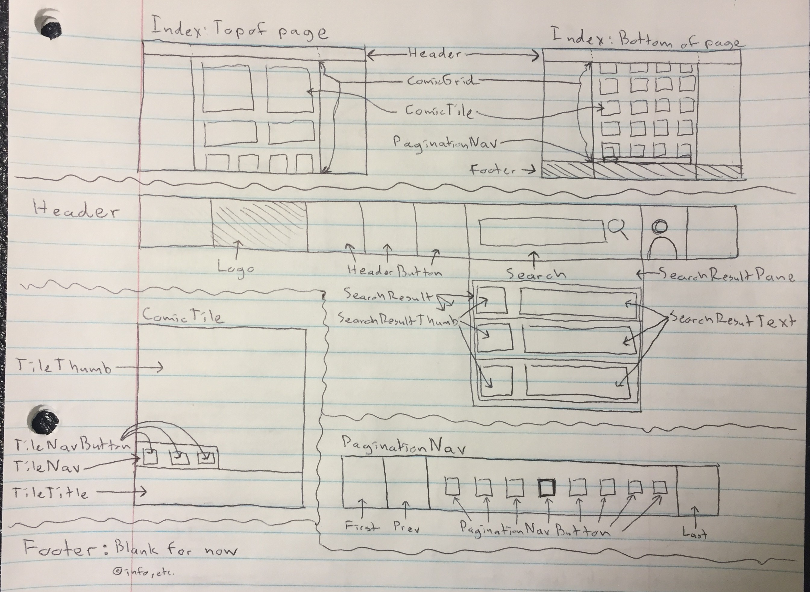
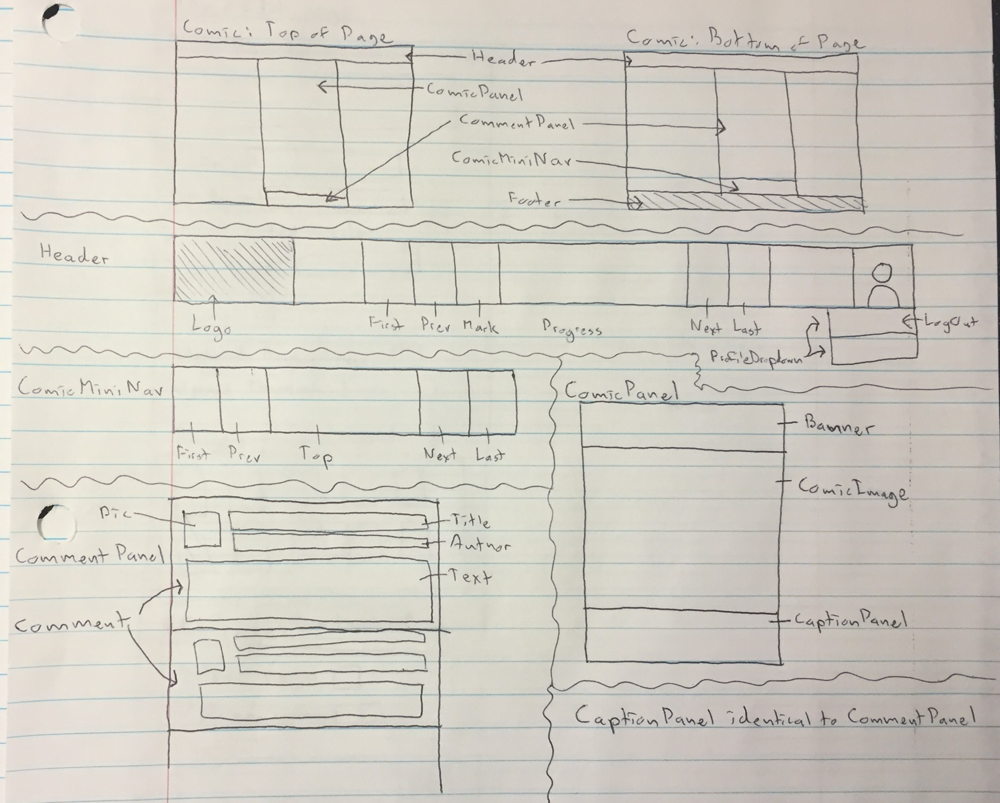
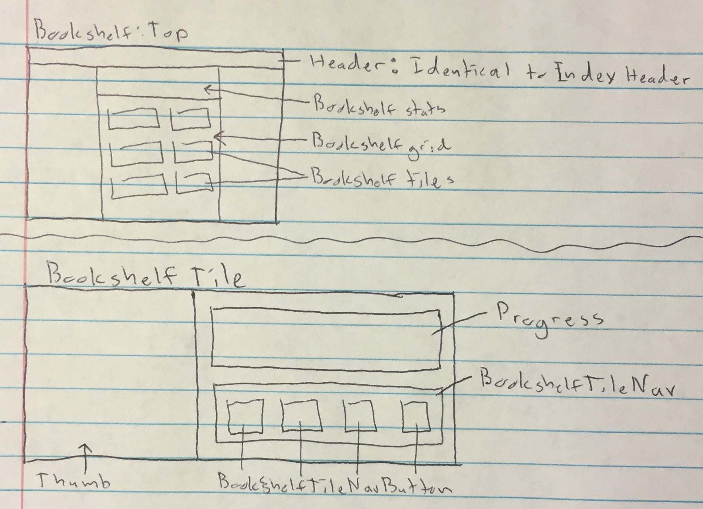
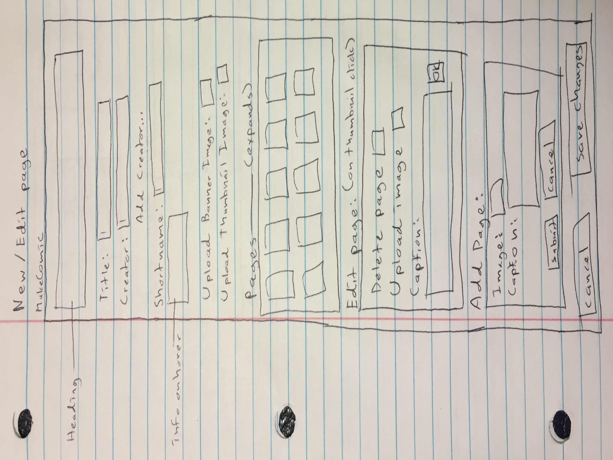

## Wireframes [[top]](#top)

       I have no idea why this image is so angry. I'm very sorry.
       I've done everything in my power to coax it into cooperating,
       and it has summarily refused. I will replace these with lovely,
       well-behaved screenshots in the production readme.  
